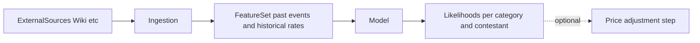

# Price Adjustment Algorithm — Product Requirements Document

## 1. Executive Summary

**Document purpose:** This PRD defines the automatic weekly price-adjustment system for Survivor Fantasy: (a) **weighted performance-based adjustment** that weights how contestants earned points in the past week and applies proportionate price deltas, and (b) an **ML pipeline** that gathers data from the internet to estimate likelihoods of future point-scoring opportunities based on events that have already happened, and uses those likelihoods to inform pricing.

**Relationship to main product:** This algorithm extends the existing [Contestant Price System](survivor_fantasy_prd.md#7-contestant-price-system) (main PRD Section 7) and integrates with the [Fantasy Scoring System](survivor_fantasy_prd.md#9-fantasy-scoring-system) (Section 9). Prices remain stored in `contestant_episode_prices` and served via `/api/prices`; materialization is today in [app/lib/materializePrices.ts](app/lib/materializePrices.ts).

### Goals

| Goal | Description |
|------|-------------|
| **Weighted adjustment** | Adjust contestant prices every week using configurable weights per point category (e.g. Survival vs. Individual immunity vs. Vote matched) so that *how* points were earned affects the price delta. |
| **ML-informed likelihoods** | Use a machine learning pipeline that gathers external data to estimate likelihoods of future point-scoring opportunities (e.g. immunity wins, confessionals, advantage plays) conditioned on what has already happened this season. |
| **Automation** | Run the full pipeline (optional ingestion → ML inference → weighted performance → price update) after each episode’s data is final, via admin-trigger or cron. |

### Scope

- **In scope:** Algorithm and data pipeline design; integration points with existing materialization and admin flows; configuration and explainability requirements; external data requirements and ML output contract.
- **Out of scope for this PRD:** Full implementation of scrapers or ML training code; choice of ML framework or hosting; multi-season support (main PRD is Season 50 only).

---

## 2. Current System Context

The following is summarized from the main PRD and codebase so the algorithm design stays consistent.

### 2.1 Prices Today

- **Storage:** [contestant_episode_prices](app/supabase/migrations/00020_contestant_episode_prices_and_points.sql): `episode_id`, `contestant_id`, `price`, `price_change`.
- **Materialization:** [app/lib/materializePrices.ts](app/lib/materializePrices.ts) computes prices from episode outcomes and scoring config. Formula: `adjustment = current_price × 0.03 × clamp(perfRatio, -1, 1)` where `perfRatio = (contestant_pts - avg_pts) / |avg_pts|`. No category weighting; only total episode points vs. field average.
- **Bounds:** Floor $50,000, ceiling $300,000, round to nearest $5,000. Eliminated players: price frozen at last value.

### 2.2 Point Categories

Point breakdown categories are defined in [app/lib/scoring.ts](app/lib/scoring.ts) (`POINT_BREAKDOWN_CATEGORIES`) and in [main PRD Section 9](survivor_fantasy_prd.md#9-fantasy-scoring-system). Canonical list:

Survival, Team immunity (1st), Team immunity (2nd), Team immunity (last), Team reward (1st), Win team reward, Win individual reward, Individual immunity, Vote matched, Correct target vote, Zero votes received, Voted out, Confessionals (4-6), Confessionals (7+), Clue read, Gain advantage, Advantage played, Idol played, Idol failed, Quit, Final tribal, Win season, Episode rank bonus.

Per-episode **breakdown by category** is already stored in `contestant_episode_points.breakdown` (JSONB). No schema change is required to support weighted historical performance.

### 2.3 Architecture Constraints

From the [main PRD Section 2](survivor_fantasy_prd.md#2-deployment-and-architecture-constraints-non-negotiable):

- Serverless (Vercel); no long-running Node servers.
- All persistent state in Supabase (Postgres).
- Any ML or data-gathering must be runnable as **triggered jobs** (e.g. cron, admin-triggered API, or external worker with DB access)—no persistent in-memory state.

---

## 3. Weighted Performance-Based Adjustment

### 3.1 Inputs

For the **just-completed episode**, for each **active** contestant (not yet voted out):

- **Point total:** From `contestant_episode_points.total_points` for that episode.
- **Breakdown by category:** From `contestant_episode_points.breakdown` (keys align with `POINT_BREAKDOWN_CATEGORIES` / display labels). Each key maps to points earned in that category for that episode.

Eliminated contestants are excluded from the adjustment; their price remains frozen as in the current system.

### 3.2 Category Weights

**Requirement:** The system must support **configurable weights per point category** so that “how” points were earned affects the price delta. For example:

- Heavier weight on **Individual immunity**, **Vote matched**, **Advantage played**, **Episode rank bonus** (high-impact, variable events).
- Lighter weight on **Survival** (common to all who survive) and **Team immunity (1st)** (shared team outcome).

Weights are stored in DB or app config (e.g. `scoring_config` or a dedicated `price_adjustment_config` table) so product can tune without code deploy. Each category in the breakdown has a numeric weight (e.g. 0.5–2.0); categories not present in the breakdown default to weight 1.0 or 0 as specified by config.

### 3.3 Proportionate Price Delta

**Performance score (per contestant):** Combine weighted performance into a single score, e.g.:

- **Weighted sum:** `weightedScore_c = Σ (weight_category × points_category)` over all categories for contestant c in the episode.
- **Relative to field:** Compute `avgWeightedScore` over active contestants. Then define a performance ratio, e.g. `perfRatio_c = (weightedScore_c - avgWeightedScore) / max(|avgWeightedScore|, ε)` so that above-average weighted performance is positive and below-average is negative.

**Price change:** Map performance ratio to a price delta:

- **Formula (extending current):** `adjustment = current_price × adjustment_rate × clamp(perfRatio, -1, 1)` where `adjustment_rate` is configurable (current default 0.03).
- **Bounds:** Apply price floor ($50,000), ceiling ($300,000), and rounding (e.g. nearest $5,000) as in the current [materializePrices.ts](app/lib/materializePrices.ts) logic.

**Output:** New price and `price_change` for each contestant for the next episode, written to `contestant_episode_prices` in the same shape as today so `/api/prices` and existing clients need no change.

### 3.4 Optional: ML Scaling

If the ML pipeline (Section 5) produces **likelihoods or expected opportunities** per contestant, the price-adjustment step may optionally:

- Scale or dampen the performance ratio by expected opportunity (e.g. contestants with higher predicted confessional/immunity opportunity get a slightly different effective adjustment), or
- Use likelihoods as a separate “expected value” layer that adjusts the baseline or the cap.

This is **optional in v1**; the weighted performance formula above must work without any ML output.

---

## 4. Configuration and Operability

### 4.1 Weights and Parameters

| Item | Requirement |
|------|-------------|
| **Category weights** | Stored in DB or config (e.g. `scoring_config` or `price_adjustment_config`); editable by admin without deploy. |
| **Adjustment rate** | Configurable (e.g. ±3% per episode); same bounds as today unless explicitly changed. |
| **Floor / ceiling / rounding** | As in main PRD Section 7 unless overridden by price_adjustment config. |

### 4.2 Explainability

The system must be able to **explain** per-contestant price change, for example:

- “+$X from Survival, +$Y from Individual immunity, …” (category-level contribution to the performance score), or
- “Weighted performance score Z (field avg W); adjustment rate R → price delta $D.”

This supports admin debugging and a future user-facing “why did this price change?” UI.

### 4.3 Auditability

For each run that produces prices for an episode, the system should **log or store**:

- Weights and config used.
- Per-contestant breakdown (points by category, weighted score, perfRatio, price delta).
- If ML is used: ML output version or snapshot (e.g. forecast table version) so adjustments can be reproduced or debugged.

Storage may be a dedicated audit table, append-only log, or artifact in object storage; exact format TBD at implementation.

---

## 5. ML Component: Purpose and Data

### 5.1 Purpose

The ML pipeline estimates **likelihoods of future point-scoring opportunities** given what has already happened this season. Examples:

- Probability (or expected rate) of winning individual immunity in upcoming episodes.
- Likelihood of attending tribal (pre-merge: tribe-dependent).
- Expected confessionals or “visibility” in the next episode.
- Likelihood of finding or playing an advantage/idol.

These likelihoods can be used to:

- **(a)** Inform or adapt category weights (e.g. upweight categories that are predicted to be more variable).
- **(b)** Scale or dampen price moves (e.g. avoid over-penalizing someone with low visibility so far but high predicted future opportunity).
- **(c)** A separate “expected value” layer that influences price or display (optional in v1).

### 5.2 Conditioning on “What Has Already Happened”

The model must condition on **in-season events so far**:

- Episodes aired; who was voted out; boot order.
- Who won team/individual immunity and rewards.
- Who found or played idols/advantages; confessional counts per contestant.
- Tribe composition and swaps (if any); phase (pre-merge vs. post-merge).

Optionally, condition on **historical patterns** (e.g. rates of immunity wins by episode number, idol finds by phase) from past seasons to inform priors or features.

### 5.3 Data from the Internet

The PRD specifies **what** to gather and **from where** as requirements; implementation (scrapers, APIs, hosting) is TBD.

| Data | Source (suggested) | Use |
|------|--------------------|-----|
| Historical season data | Survivor Wiki / Fandom (e.g. challenge wins by player type, boot order, confessional counts) | Base rates, priors, or features for ML. |
| Past seasons (aggregate) | Same or curated datasets | Rates of immunity wins, idol finds, vote-outs by episode number or phase (pre-merge vs. post-merge). |
| Current season (Season 50) | Already in app: `episode_outcomes`, `contestant_episode_points` | Primary in-season features. |
| Current season (external) | Optional: scraped or manually entered “storyline” or edit visibility | Proxy for confessional/opportunity likelihood. |

Compliance and legal (e.g. ToS of third-party sites, rate limiting) must be addressed at implementation time.

### 5.4 ML Pipeline Output Contract

The price-adjustment step (Section 3) may **read** from the ML pipeline. The contract is:

- **Per contestant, per category (or per opportunity type), per episode or phase:** a **probability** or **expected value** (e.g. expected points from that category in the next episode).
- **Storage:** Schema placeholder—e.g. a table `contestant_opportunity_forecasts` with (contestant_id, episode_id or phase, category/opportunity_type, probability or expected_value), or a JSONB in `season_state`. Implementation chooses exact schema; the price-adjustment job must know how to read it.
- **When updated:** After new episode data is available and (if used) after external data ingestion. May be updated in the same job as price materialization or in a prior step.

---

## 6. Algorithm Pipeline and Schedule

### 6.1 Weekly Trigger

After each episode’s data is **final** (admin has set outcomes and materialized points for that episode):

1. **Optional: Data ingestion** — Scrape or pull external data (Wiki, historical aggregates, etc.) and store in a form the ML step can consume.
2. **Optional: ML inference** — Run the model; write likelihoods/forecasts to the DB (per contract in 5.4).
3. **Weighted performance calculation** — For the just-completed episode, compute weighted scores and performance ratios from `contestant_episode_points.breakdown` and category weights.
4. **Price update and materialization** — Compute new prices (and optionally apply ML scaling), enforce floor/ceiling/rounding, then UPSERT into `contestant_episode_prices` for the next episode.

Steps 1–2 are optional for v1; step 3–4 must work using only in-app data and weights.

### 6.2 Integration

- **Trigger:** Admin-triggered (e.g. “Run price adjustment” in admin panel after materializing points) or **cron** (e.g. nightly job that runs only when `current_episode` has advanced and new episode data exists).
- **Execution:** Must respect [architecture constraints](survivor_fantasy_prd.md#2-deployment-and-architecture-constraints-non-negotiable): no long-running server. Use serverless functions (e.g. Vercel serverless or Supabase Edge) or an external worker with DB access that runs and exits. Long-running ingestion or training may run in an external pipeline and write results back to Supabase.

### 6.3 Data Flow Diagram

### 6.4 ML Data Flow Diagram

---

## 7. Non-Goals and Assumptions

### 7.1 Non-Goals (for this PRD)

- Full implementation of scrapers or ML training code.
- Choice of ML framework or hosting.
- Multi-season support (main PRD is Season 50 only).
- Changes to the public API of `/api/prices` or the schema of `contestant_episode_prices` beyond what is needed to support the new formula (e.g. optional audit/explanation storage).

### 7.2 Assumptions

- Episode outcomes and point breakdowns remain the **source of truth**; admin still triggers or approves episode advancement.
- Architecture stays **serverless (Vercel) + Supabase**; any new jobs fit within triggered/short-lived execution.
- Category labels in `contestant_episode_points.breakdown` stay aligned with [POINT_BREAKDOWN_CATEGORIES](app/lib/scoring.ts) so weights can be applied by key.

---

## 8. Success Criteria and Future Work

### 8.1 Success Criteria

| Criterion | Description |
|-----------|-------------|
| **Weighted composition** | Price changes reflect not just total points but the **composition** of how points were earned (category weights applied correctly). |
| **ML pipeline** | When implemented, the ML pipeline produces **usable likelihoods** from the defined external data and in-season events, and writes them per the output contract (Section 5.4). |
| **One-click or cron** | A single run (admin-triggered or cron) from current app state produces **updated prices** for the next episode with **explanation** (audit/explainability as in Section 4). |

### 8.2 Future Work

- Retraining the ML model on new historical data or new seasons.
- A/B testing different weight sets and adjustment rates.
- User-visible “Why did this price change?” UI using the explanation data.
- Extending the ML output to drive in-app “expected value” or “upside” indicators (without changing core pricing formula).

---

## 9. References

- [Survivor Fantasy PRD](survivor_fantasy_prd.md) — Main product requirements (Section 7 Price System, Section 9 Scoring, Section 2 Architecture).
- [app/lib/materializePrices.ts](app/lib/materializePrices.ts) — Current price materialization and formula.
- [app/lib/scoring.ts](app/lib/scoring.ts) — Point breakdown categories and contestant episode breakdown calculation.
- [contestant_episode_prices / contestant_episode_points](app/supabase/migrations/00020_contestant_episode_prices_and_points.sql) — Canonical price and point storage.
