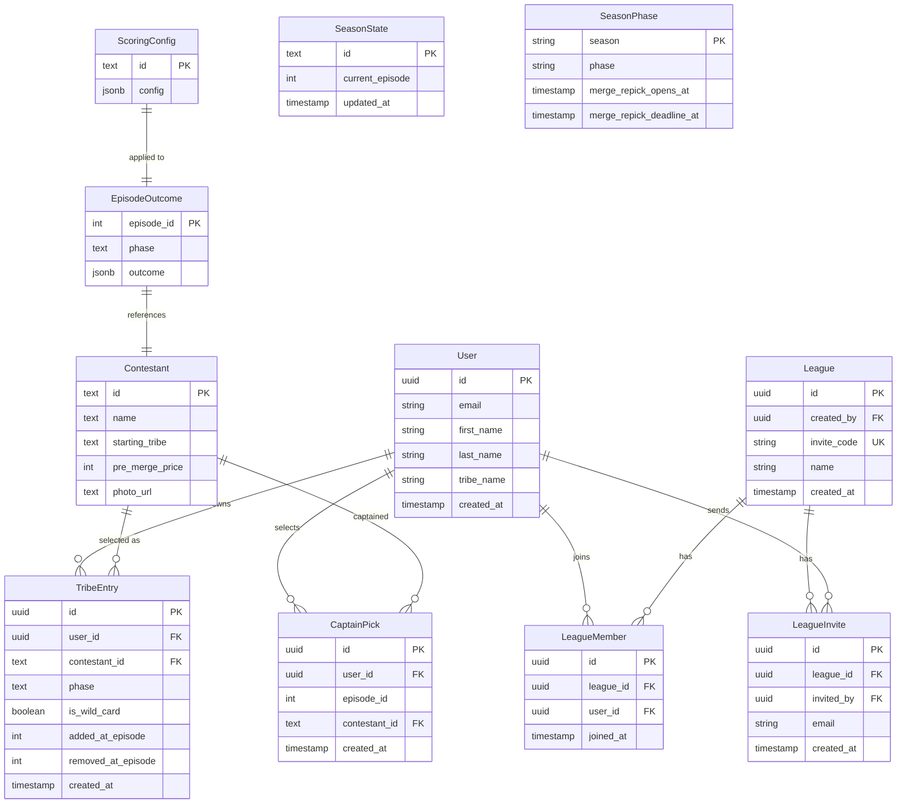
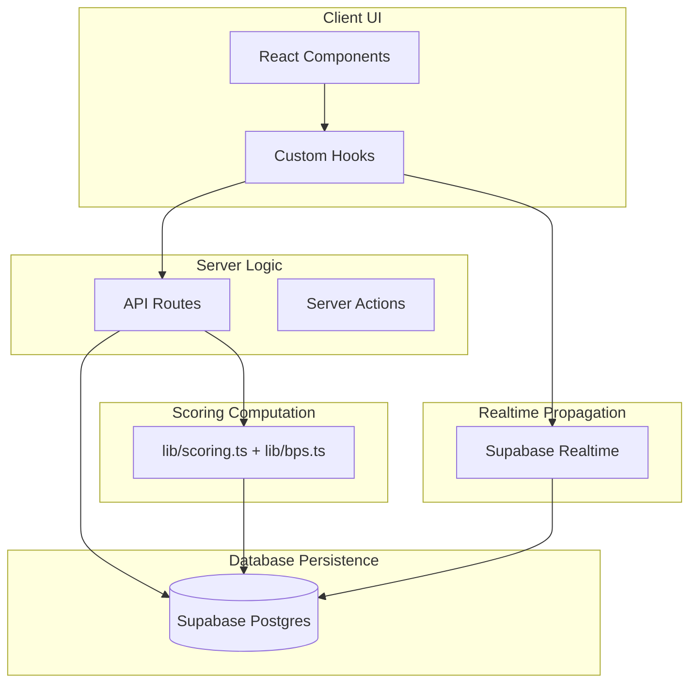
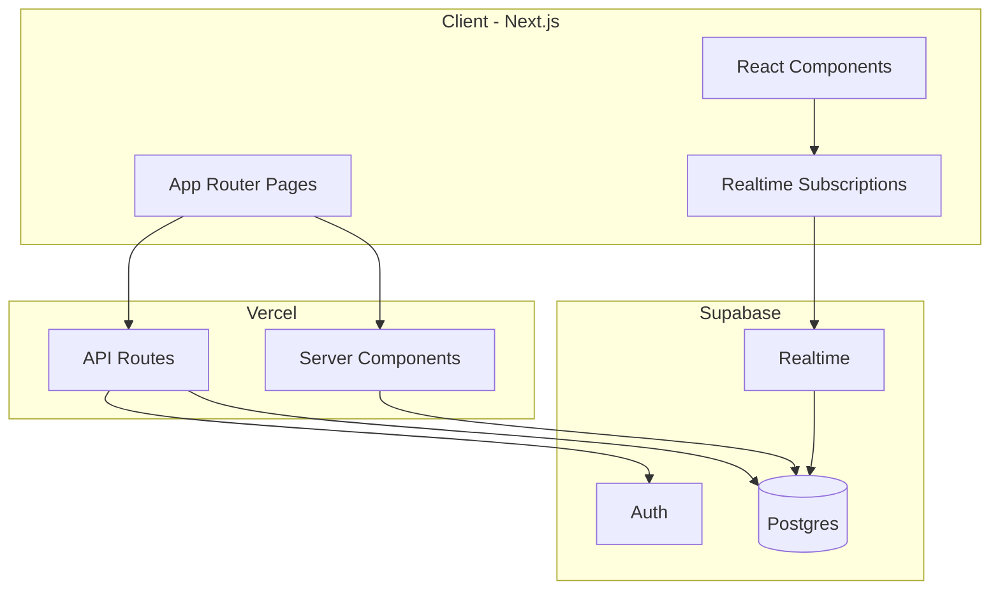
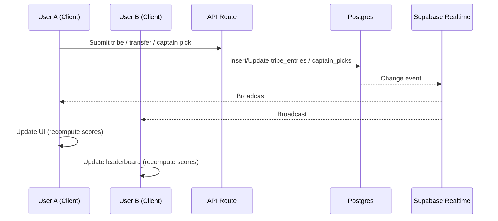

# Survivor Fantasy — Product Requirements Document

## 1. Executive Summary

**Project Name:** Survivor Fantasy

**One-Line Description:** FPL-style Survivor fantasy for Season 50—one Tribe per user, private leagues for friend comparisons, and a global leaderboard.

**Core Value Proposition:** Users create an account and build a single **Tribe** (their fantasy team) under a $1M salary cap. That Tribe competes everywhere: in **Leagues** (private groups with friends, invite/code only) and on the **Global Leaderboard** (ranked against all players). Two phases: **Pre-Merge** (7 contestants: min 1 per starting tribe; lock 1 hr before first episode) and **Post-Merge** (5 contestants; merge repick when episode-before-merge ends; deadline 1 hr before merge episode). Scoring distribution: ~35% Survival, ~15% Team Challenges, ~50% Individual Performance. Captain system doubles one player's points per episode. Episode Impact Bonus (BPS) awards top-3 performers. UI inspired by Fantasy Premier League with Survivor-themed aesthetic.

**Scope:** Season 50 only. No multi-season support in v1.

**Target:** Production-quality, deployable, mobile-first web application for portfolio showcase. Must demonstrate budget enforcement, phase-based state management, on-the-fly scoring computation, serverless architecture, and mobile-first product design.

### Current Prototype State

| Feature | Status |
|---------|--------|
| **Auth** | Implemented; Supabase Auth (email/password + Google OAuth); onboarding flow for profile (first name, last name, tribe name) |
| **Tribe Builder** | Implemented; 7 contestants, $1M cap, min 1 per tribe |
| **Captain System** | Implemented; per-episode captain selection with 2x multiplier; auto-assigned on tribe creation; slot always filled (auto-assign if unset); if captain is transferred out, the incoming player becomes captain for that episode |
| **Scoring Engine** | Implemented; on-the-fly computation from point overrides (admin-driven) |
| **Scoring source** | Implemented; user-facing points from **point_category_overrides** only (admin-driven); no raw episode_outcomes for main totals; BPS/breakdown used for display where applicable |
| **Transfer System** | Implemented; sell/add swaps with -5 penalty per add; multiple simultaneous transfers |
| **Dynamic Pricing** | Implemented; ±3% adjustment per episode; frozen for eliminated players |
| **Possession Tracking** | Implemented; admin-editable counts in `contestant_possessions`; idols, advantages, clues shown on Pick Team cards; tribe ribbon (horizontal only, no diagonal overlay on photo) |
| **Points Page** | Implemented; episode navigation, contestant breakdown modals |
| **Pick Team Page** | Implemented; drag-and-swap captain, possession icons, tribe ribbon |
| **Transfers Page** | Implemented; sell/add with real-time budget display |
| **Leagues** | Implemented; create/join by code; Your Leagues list; standings per league; creator auto-added; GET uncached |
| **Global Leaderboard** | Implemented; `/api/leaderboard`; shown on Leagues page |
| **Merge Repick** | Not yet implemented |
| **Admin Panel** | Implemented; `/admin`: point overrides by category, pricing & traits, idol/advantage/clue counts, home content, current episode |
| **Notifications** | Not yet implemented |

**Episode progression:** Controlled by admin (via `season_state` table). No user-facing "advance episode" button; the current episode updates when the admin inserts new episode outcome data.

### Episode State and Tab Semantics

The app treats **`season_state.current_episode`** as the **next approaching episode** (the episode we are building a team for). For example, when `current_episode` is 2, episode 1 has already aired and we are leading into episode 2.

| Tab / Area | What it shows | Behavior |
|------------|----------------|----------|
| **Points** | Points for the **last completed episode** only (i.e. `current_episode - 1`). | When `current_episode <= 1` (week 0, before episode 1): show a message that points will be shown once the episode starts; no episode selector or breakdown. When `current_episode >= 2`: show episode `current_episode - 1` points; tab is **locked** so the user can only view episodes 1 through last completed (no navigating to future episodes). Default view is always the last completed episode. |
| **Pick Team** | The **team leading into the next episode** (roster and captain for `current_episode`). | Any team changes (captain, transfers) made between episodes are reflected here. Copy should frame as "Your team for Episode X" or "Leading into Episode X" where X = `current_episode`. |
| **Transfers** | Same as Pick Team: **team leading into the next episode** (`current_episode`). | Transfers and captain picks apply to the upcoming episode. Copy: "Leading into Episode X" or "After Episode Y" (Y = current_episode - 1). |
| **Home** | Points preview and link to Points use the **last completed episode**. Subtitle reflects "Leading into Episode X" (X = current_episode). | When no episode has aired (`current_episode <= 1`), points preview shows the preseason message; link goes to Points page which shows the same message. |

**Week 0 (before episode 1):** Points tab shows only the message that points will appear once the episode starts. Pick Team and Transfers show the team for episode 1 (first upcoming episode). Once the deadline for an episode starts, the Points tab is locked to the last completed episode; Pick Team and Transfers show the team for the next week.

### Contestant Data

The prototype uses the actual **Survivor Season 50** cast:

- **24 contestants** with real names and Survivor Wiki profile photos
- **3 starting tribes:** Cila (Tribe A, orange), Kalo (Tribe B, pink), Vatu (Tribe C, blue)
- Photos served through `/api/image-proxy` to handle external image hosting
- Names displayed as "Firstname L." format (e.g. "Angelina K.")
- Current tribe derived from `contestant_tribes` field in episode outcomes

### API Routes (Prototype)

| Route | Method | Purpose |
|-------|--------|---------|
| `/api/scores` | GET | Compute and return full scoring breakdown with contestant-level detail (from point_category_overrides + roster + captain) |
| `/api/app-data` | GET | Bootstrap for home: scores, contestants, season, captain, isAdmin |
| `/api/transfers` | POST | Execute sell/add transfers with validation |
| `/api/captain` | GET/POST | Get or set captain pick per episode |
| `/api/tribe` | GET/POST | Get or create initial tribe roster |
| `/api/roster` | GET | Get current active roster entries |
| `/api/contestants` | GET | Get all contestants with metadata |
| `/api/prices` | GET | Get dynamic prices through a given episode |
| `/api/eliminated` | GET | Get list of eliminated contestants through a given episode |
| `/api/season` | GET | Get current episode number; POST (admin-only) for episode advancement |
| `/api/image-proxy` | GET | Proxy external contestant photos |
| `/api/profile` | GET/POST | Get or create user profile |
| `/api/home-content` | GET | Public list of published home articles |
| `/api/article/[slug]` | GET | Single article by slug |
| `/api/leagues` | GET/POST | List user's leagues / create a new league |
| `/api/leagues/[id]` | GET | Get league details with full standings |
| `/api/leagues/join` | POST | Join a league by invite code |
| `/api/leagues/[id]/invite` | POST | **Not implemented**; invite via email is planned |
| `/api/leaderboard` | GET | Global leaderboard (all users ranked by total points) |
| `/api/admin/point-category-overrides` | GET/POST/DELETE | List/add/remove point overrides by contestant, episode, category; DELETE `?all=true` clears all (zeros every contestant’s points) |
| `/api/admin/points-breakdown` | GET | Points breakdown for admin (episode-scoped) |
| `/api/admin/possessions` | GET/PATCH | List or bulk-update idol/advantage/clue counts per contestant |
| `/api/admin/contestants/[id]` | PATCH | Update contestant price and traits (physicality, cognition, strategy, influence, resilience) |
| `/api/admin/home-content` | GET/POST | List or create home content items |
| `/api/admin/home-content/[id]` | PATCH/DELETE | Update or delete home content item |
| `/api/account/delete` | DELETE | Delete user account and associated data |

### Pre-Season Launch

Before any episode has aired, the app supports a clean preseason state and draft-only UX.

**Pre-season state (data):**

- No episode outcomes in the database; `season_state.current_episode = 0`; contestants and schema intact; no gameplay data populated.
- All numeric gameplay fields are null, 0, or empty as appropriate.

**Home page:**

- Countdown to first episode using constant `FIRST_EPISODE_AIRTIME`; client-side only; format: days / hours / minutes / seconds; at zero show 00:00:00.

**Transfers page (pre-season):**

- Draft-only: list of all transferable players; users can swap players into a draft version of their team; no persistence; no transfer confirmation or submission; draft state exists only in frontend state.

**Budget & penalty preview:**

- Derived from committed team vs draft team: show remaining budget and total projected point penalties; update live as draft changes; no backend writes; penalties are informational only.

**Explicit non-goals (pre-season scope):**

- No transfer confirmation or submission; no new backend endpoints; no changes to scoring or pricing logic; no refactor of unrelated components; no season progression logic.

---

## 2. Deployment and Architecture Constraints (Non-Negotiable)

### Hosting Target

| Component | Host |
|----------|------|
| Frontend + API | Vercel |
| Database | Supabase (Postgres) |
| Auth | Supabase Auth |
| Realtime | Supabase Realtime |

### Hard Rules

| Rule | Requirement |
|------|--------------|
| No local-only services | All services must be cloud-hosted and accessible in production |
| No in-memory state as source of truth | All persistent state must live in the database |
| No long-running Node servers | No `app.listen`, no persistent Node processes |
| No ws://localhost | Realtime must use Supabase Realtime or equivalent serverless-compatible solution |
| All persistent state in DB | Database is the single source of truth |
| All secrets from env vars | No hardcoded credentials; use `process.env` |
| Serverless environment | Must work on Vercel serverless functions |

**Mandate:** If any part is not deployable or violates these constraints, it must be redesigned.

---

## 3. Tech Stack

| Technology | Purpose | Rationale |
|------------|---------|-----------|
| **Next.js (App Router)** | Frontend + API routes | Serverless-compatible, Vercel-native, supports RSC and API routes |
| **Supabase Postgres** | Database | Managed Postgres, RLS for security, serverless-friendly |
| **Supabase Auth** | Authentication | Built-in email/password and OAuth, integrates with Postgres |
| **Supabase Realtime** | Live updates | Postgres change streams, no WebSocket server to maintain |
| **Tailwind CSS** | Styling | Utility-first, responsive, mobile-friendly, small bundle |

### Architectural Decisions

- **Next.js App Router:** Enables server components for initial data fetch and API routes for mutations. No separate backend server.
- **Supabase over Firebase:** Postgres provides relational schema for leagues, tribes, scores; RLS enforces access control; Realtime is Postgres-based.
- **Tailwind:** Fast iteration, consistent spacing/sizing for mobile breakpoints, no runtime CSS-in-JS overhead.

---

## 4. Mobile-First Design Requirements

### Primary Target

**Mobile is the primary target.** Desktop is secondary. The app must be fully usable on a phone.

### Required Mobile Behaviors

The entire flow must work on a phone:

1. Sign up (first name, last name, tribe name) and login
2. Build Tribe (pre-merge: 7 contestants; post-merge: 5 contestants)
3. Create league or join via invite link / 6-char code
4. View My Tribe (weekly points), Leagues, and Global Leaderboard
5. View league members' tribes (after roster lock) with weekly breakdown

### Design Rules

| Rule | Requirement |
|------|-------------|
| No hover-only interactions | All actions must be tappable/clickable |
| Touch-friendly buttons | Minimum 44px touch targets |
| No fixed-width layouts | Use responsive units (%, rem, vw) |
| Tribe builder | Stack vertically on mobile; allow scrolling where needed |
| Text | Readable without zooming (min 16px body text) |

### Responsive Behavior Notes

- **Tribe builder:** On mobile, contestant grid stacks vertically or uses horizontal scroll; budget indicator ($1M cap) always visible.
- **Leaderboard:** Table scrolls horizontally or converts to card layout on small screens.
- **League view:** Member list with tribe names + points; tap to see full roster and weekly breakdown (FPL-inspired).
- **Navigation:** Bottom nav or hamburger for mobile; top nav acceptable on desktop.

---

## 5. Core User Flow

```
Landing → Sign Up (first name, last name, tribe name) → Accept Terms & Privacy Policy
    → Build Tribe (pre-merge: 7 contestants, $1M cap, min 1 per tribe)
    → Select Captain for upcoming episode
    → Create League OR Join via invite link / 6-char code
    → Home: My Tribe (weekly points) → Points → Transfers → Pick Team → Leagues
    → Pre-Merge Season: Weekly scoring until merge; transfer window after each episode (sell/add swaps)
    → Merge Repick: Opens when episode-before-merge ends; deadline 1 hr before merge episode
    → Post-Merge: 5 contestants; weekly scoring; transfer window after each episode; pre-merge points carry over
    → Final standings: total points (league + global)
```

### Step-by-Step Flow

1. **Landing:** User sees value prop and CTA to log in or sign up.
2. **Sign Up:** User provides first name, last name, tribe name (user-chosen; cannot change after signup). Must accept Terms of Service and Privacy Policy before account creation. Tribe name validated for slurs/bad words (free third-party API if available, otherwise blocklist).
3. **Auth:** Supabase Auth (email/password or OAuth). Account required for all participation.
4. **Build Tribe:** User selects 7 contestants (pre-merge) under $1M cap with minimum 1 from each starting tribe (Cila, Kalo, Vatu). Can build/revise until lock (1 hr before first episode). Late joiners can build anytime; they miss points for already-aired episodes.
5. **Select Captain:** Before each episode, user selects one roster member as captain. Captain's points are doubled for that episode.
6. **Leagues:** User creates a league (sets name only) or joins via invite link / 6-char code. Anyone can create; private only; no max size; join anytime. Cannot leave once joined.
7. **Home (FPL-inspired):** Clickable points header; quick links to Points, Transfers, Pick Team, Leagues. Shows Tribe Builder if no tribe created.
8. **Points Page:** Episode-by-episode scoring with navigation arrows. Click "Get info" for detailed contestant breakdown modal with close-up photo and per-episode point sources.
9. **Pick Team:** Sports-style display with captain at top, roster below. Drag-and-swap captain with confirmation modal. Shows possession icons (idols/advantages/clues).
10. **Transfers:** Sell/add players in 1-for-1 swaps. Budget updates in real-time. Eliminated players flagged as "OUT" and unbuyable.
11. **Merge Repick:** Opens when episode-before-merge ends. Deadline: 1 hr before merge episode. User rebuilds with 5 contestants from remaining pool (re-priced). If no submit: auto-assign random team with priority to pre-merge roster members.
12. **League View:** After roster lock, see members' tribe names + aggregated points; tap to view full roster and weekly breakdown.
13. **Global Leaderboard:** Includes everyone who has ever built a tribe.

### Auth & Legal

- **Supabase Auth** with email/password + optional OAuth (Google).
- **Terms of Service** and **Privacy Policy** required before signup; must comply with GDPR, CCPA, and applicable privacy laws.

### Password Requirements

| Rule | Requirement |
|------|-------------|
| Minimum length | 8 characters |
| Uppercase letter | At least 1 uppercase letter (A-Z) |
| Lowercase letter | At least 1 lowercase letter (a-z) |
| Number | At least 1 digit (0-9) |
| Symbol | At least 1 special character (!@#$%^&*etc.) |

**Password strength indicator:** Real-time progress bar displayed below the password field as the user types:
- **Red** (weak): fewer than 3 of 5 rules met
- **Yellow** (medium): 3–4 of 5 rules met
- **Green** (strong): all 5 rules met

**Error messages:** Each unmet rule is displayed as a checklist item below the strength bar (e.g. "Must contain at least 1 uppercase letter"). Items turn green with a checkmark when satisfied.

**Validation:** Client-side for instant feedback; server-side validation before account creation.

---

## 6. League & Tribe System

### Design Goals

- **Avoid season-ending punishment** from early eliminations
- **Force meaningful tradeoffs** via a budget system
- **Preserve differentiation** between users' tribes
- **Align fantasy incentives** with Survivor's narrative structure (pre-merge vs post-merge)
- **Keep rules explainable and tunable**

### Explicit Non-Goals (v1)

| Excluded | Not in scope |
|----------|--------------|
| Snake drafts | No turn-based drafting |
| Per-episode transfer limits | Sell/add allowed after each episode; no cap on swaps per window |
| Elimination-based team death | No "your team is dead" states |

### League Attributes

| Attribute | Description |
|-----------|-------------|
| Unique join code | 6 alphanumeric characters (e.g. `ABC123`); permanent, never expires |
| Invite link | Shareable link (e.g. `/leagues/join?code=ABC123`) |
| League name | Set by creator only |
| Members | Users who joined; **no maximum league size** |
| Multiple leagues | Users can belong to **multiple leagues** simultaneously |
| Creator | Can only set league name; **no admin controls** (cannot delete league, kick members, or transfer ownership) |
| Leaving | Users cannot leave a league once joined |
| Creator leaves | League continues; no ownership transfer needed |

### Invitation System

| Method | Flow |
|--------|------|
| **Code** | 6 alphanumeric join code; permanent; users enter code on the Leagues page to join |
| **Link** | Shareable URL containing the code (e.g. `/leagues/join?code=ABC123`); can be shared via any channel |
| **Email** | Creator enters an email address; system sends an invite email with a join link; recipient clicks to join (prompted to sign up if needed) |

**Join requirements:** Account required. Invite link/email prompts login/signup if user is not authenticated. If already a member, system tells them they're already in the league. No limit on league size. Users can join as many leagues as they want.

### Global Leaderboard

All users who have built a tribe are automatically included in the **Global Leaderboard**. This is not a league that users join — it is computed from all users' scores.

| Attribute | Description |
|-----------|-------------|
| Automatic inclusion | Every user with a tribe appears on the global leaderboard |
| Ranking | Sorted by total points (pre-merge + post-merge cumulative) |
| Display | Tribe name (primary), first + last name underneath in lighter gray, total points |
| No opt-out | All users are visible on the global leaderboard |
| Accessible from | Leagues page (tab or section) and Home page snippet |

---

### Tribe (User's Team)

| Attribute | Description |
|-----------|-------------|
| **One per user** | Each user has exactly one Tribe; used across all leagues + global leaderboard |
| **Tribe name** | User-chosen at signup; cannot change after signup |
| **Display** | Tribe name (primary); first + last name underneath in lighter gray |
| **Content moderation** | Tribe name validated for slurs/bad words; free third-party API if available, otherwise blocklist |
| **Account deletion** | Tribe deleted when user deletes account |

---

### Phase 1: Pre-Merge Tribe Construction

| Rule | Implementation |
|------|----------------|
| **Roster size** | 7 contestants total |
| **Tribe constraint** | Minimum 1 contestant from each of the 3 starting tribes (Cila, Kalo, Vatu) |
| **Salary cap** | Fixed $1,000,000; all users have same budget |
| **Prices** | Contestant prices in dollars; adjust dynamically after each episode (see Section 7) |
| **Lock** | 1 hour before first episode airs |
| **Late joiners** | Can build tribe anytime; lock when they submit; miss points for already-aired episodes |
| **Budget enforcement** | Server validates; rejects if over cap or violates tribe constraint |

### Phase 2: Merge Repick (Critical)

| Rule | Implementation |
|------|----------------|
| **Opens** | When episode-before-merge ends |
| **Deadline** | 1 hour before merge episode airs |
| **Roster size** | 5 contestants |
| **Eligibility** | Only remaining (non-eliminated) contestants |
| **Re-pricing** | Admin sets post-merge prices for all remaining contestants |
| **Fresh cap** | Same $1M cap |
| **Auto-repick** | If user doesn't submit by deadline: random team with priority to pre-merge roster members |
| **Late joiners** | If joining after merge: build post-merge roster only (no pre-merge phase) |
| **Points carry over** | Pre-merge fantasy points persist into post-merge total |

### Transfer System (Sell/Add)

Users can **sell** and **add** players between episodes. Transfers are 1-for-1 swaps: each sell is paired with an add. Multiple swaps can be submitted simultaneously.

| Rule | Implementation |
|------|----------------|
| **Window** | Opens after each episode airs; closes before next episode lock |
| **Swap format** | Must sell and add equal numbers of players in one transaction |
| **Sell** | Soft-delete: `removed_at_episode` set to current episode; frees budget; **no point penalty**; points earned while on team are permanent |
| **Add** | Add player from active pool; costs budget; **-5 points per add** (team-level penalty, not shown in contestant breakdown) |
| **Pool** | Only non-eliminated (active) contestants; eliminated players are unbuyable |
| **Re-add** | If a previously sold player is added back, the existing `tribe_entries` row is reactivated with updated `added_at_episode` and `removed_at_episode = NULL` |
| **Roster constraints** | Pre-merge: exactly 7 (min 1 per tribe); post-merge: exactly 5 |
| **Budget** | $1M cap; selling frees budget at current dynamic price; adding costs at current dynamic price |
| **Eliminated on roster** | Voted-out players on your roster produce 0 future points; can be sold for their frozen price |

Transfers are available during `pre_merge_locked` and `post_merge` phases (between episodes). Initial build and merge repick have their own lock semantics.

### Global Phase State

- **pre_merge:** Tribe construction open until lock.
- **pre_merge_locked:** Rosters locked; weekly scoring until merge. Transfer window opens after each episode.
- **merge_repick:** Merge repick window open; users must submit by deadline.
- **post_merge:** Post-merge rosters locked; weekly scoring until season end. Transfer window opens after each episode.

### Technical Implications

| Requirement | Implementation |
|-------------|----------------|
| **One Tribe per user** | Roster entries scoped by user_id + phase; no league_id on roster |
| **Budget enforcement** | Server validates at pre-merge lock, transfers, and merge repick; $1M cap (global), tribe constraints (min 1 per tribe) |
| **Episode-based scoring** | Episode outcomes stored as JSONB; scores computed on-the-fly; cumulative; user-scoped (not league-scoped) |
| **Transfer history** | `tribe_entries.added_at_episode` and `removed_at_episode` provide full temporal roster history |
| **Captain tracking** | `captain_picks` table stores per-episode captain selections per user |
| **Global merge transition** | Admin triggers merge; all users enter merge_repick; post-merge prices apply |

---

## 7. Contestant Price System

Contestants have a **price** (salary cost in dollars) that constrains tribe construction. Prices adjust dynamically after each episode based on performance.

### Base Prices

- **Admin manually enters** pre-season base prices for all 24 contestants (in dollars).
- Each contestant is assigned to a **starting tribe**: Cila (Tribe A), Kalo (Tribe B), or Vatu (Tribe C).
- Display: price + starting tribe in tribe builder.

### Dynamic Price Adjustments

After each episode, contestant prices adjust based on individual performance relative to the field:

| Parameter | Value |
|-----------|-------|
| **Adjustment rate** | ±3% of current price per episode |
| **Performance metric** | Contestant's episode points vs. average points of all active contestants |
| **Price floor** | $50,000 |
| **Price ceiling** | $300,000 |
| **Rounding** | Nearest $5,000 |
| **Eliminated players** | Price **frozen** at last value before elimination (can still sell for this price) |

**Formula:** `adjustment = current_price × 0.03 × clamp(perfRatio, -1, 1)` where `perfRatio = (contestant_pts - avg_pts) / |avg_pts|`.

### Merge Repick (Planned)

- **Admin re-prices** all remaining contestants for the post-merge phase.
- New prices reflect perceived endgame value; no connection to pre-merge prices.
- All users see same prices; same $1M cap.

### Display

| Display | Description |
|---------|-------------|
| **Price** | Salary cost in dollars (e.g. $150,000); updates after each episode |
| **Price change** | Arrow indicator showing increase/decrease from previous episode |
| **Starting tribe** | Contestant's original tribe (Cila, Kalo, or Vatu) |
| **Current tribe** | Derived from latest `contestant_tribes` in episode outcomes |
| **Status** | Active / eliminated (grayed out if voted out) |

### Technical Implications

- Tribe roster scoped by user + phase; pre-merge and post-merge stored separately.
- Budget enforcement at pre-merge lock and merge repick; $1M cap.
- Prices computed on-the-fly via `lib/prices.ts` and `/api/prices` endpoint.
- Eliminated contestants: price frozen, unbuyable, cannot be added to any roster.

---

## 8. Real-Time Requirements

### Events That Trigger Instant Updates

| Event | Users must see |
|-------|----------------|
| User joins league | Updated league member list |
| Tribe submitted | User's tribe locked (pre-merge or merge repick) |
| Merge triggered | Phase transition; merge repick unlocked |
| Score update | League and global leaderboards refresh |

### Realtime Behavior

- **Across devices:** Same user on phone and laptop sees same state.
- **Across networks:** Works on cellular, Wi-Fi, different ISPs.
- **After refresh or reconnect:** Client fetches current state from DB, then subscribes to Realtime; no stale state.

### Implementation Approach

- **Supabase Realtime:** Subscribe to Postgres changes on `tribe_entries`, `captain_picks`, `episode_outcomes`, `season_state`, `league_members` (planned).
- **Merge is global:** Admin marks merge; all users enter merge repick; post-merge prices apply.

---

## 9. Fantasy Scoring System

### Scoring Philosophy

- **Survival/participation** (~35%) forms the core scoring floor (making it to the next episode).
- **Team challenges** (~15%) contribute moderate variance through immunity and reward outcomes.
- **Individual performance** (~50%) including immunity wins, advantages, tribal council strategy, confessionals, and placement is weighted most heavily.
- **Strategic actions** (finding advantages, playing advantages) add variance.
- **Penalties** (voted out, quit, pocket punishment) create downside risk.
- **Captain system** doubles a selected contestant's points for an episode (see Section 9d).
- **Episode Impact Bonus (BPS)** awards top-3 performers per episode with bonus points (see Section 9e).

### Point Categories (Full Specification)

All values below reflect the current implementation. Configurable via `scoring_config` table (JSONB).

#### Survival
| Event | Points | Notes |
|-------|--------|-------|
| Pre-merge: survive episode (with tribal) | +1 | Only if the episode had a tribal council |
| Pre-merge: survive episode (no tribal) | 0 | No points if no tribal that episode |
| Post-merge: survive episode | +3 | Per person per episode |

#### Placement (Final 3 Only)
| Event | Points | Notes |
|-------|--------|-------|
| Reach final tribal | +6 | One-time |
| Win season | +10 | Winner only; stacks with final tribal |

#### Team Immunity Challenges
| Result | Points | Notes |
|--------|--------|-------|
| 1st place | +2 per person | Winning team |
| 2nd place (3-team comp) | +1 per person | Middle team |
| 2nd place (2-team comp) | +1 per person | |
| Last place / losing tribe | -1 per person | Tribe that goes to tribal |

#### Team Reward Challenges
| Result | Points | Notes |
|--------|--------|-------|
| 1st place | +1 per person | |
| 2nd place (3-team comp) | 0 | |
| 2nd place (2-team comp) | 0 | |
| Last place | 0 | |

#### Tribal Council
| Event | Points | Notes |
|-------|--------|-------|
| Vote matched (majority) | +2 | Only if contestant attended tribal (their tribe lost immunity) |
| Correct target vote | +1 | Voted for the person who was actually voted out |
| Zero votes received | +1 | Attended tribal and received no votes against them |
| Voted out | 0 base + (-1 × votes received) × 2^(items in pocket) | Base 0; -1 per vote; doubled per idol/advantage in pocket |

**Tribal attendance rule:** Vote matched and zero votes received points are only awarded to contestants who actually attended tribal council (i.e., their tribe lost the immunity challenge). Post-merge: everyone attends tribal.

#### Individual Immunity
| Event | Points | Notes |
|-------|--------|-------|
| Win individual immunity | +6 | Post-merge |

#### Confessionals
| Event | Points | Notes |
|-------|--------|-------|
| 4–6 confessionals in episode | +2 | Based on episode confessional count |
| 7+ confessionals in episode | +4 | Replaces the 4–6 tier (not additive) |

#### Advantages / Idols
| Event | Points | Notes |
|-------|--------|-------|
| First to read clue | +2 | Everyone in first group to read gets +2 |
| Successful advantage play | +5 | Steal vote, etc. |
| Immunity idol played | +2 per vote nullified | Scales with votes blocked |
| Idol played (failed) | -2 | Played but no votes nullified |

#### Other
| Event | Points | Notes |
|-------|--------|-------|
| Quit | -10 | |
| Medevac | 0 | No penalty |
| Add player (transfer) | -5 | Per add; sell has no penalty |

Exact values configurable via admin; stored server-side as JSONB in `scoring_config` table. **Global**—same rules for all users and leagues.

**Eliminated contestants:** Once voted out, a contestant earns 0 points in all subsequent episodes, cannot be added to any roster (unbuyable), and their market price is frozen at the last value before elimination.

### Scoring Rules

| Rule | Requirement |
|------|-------------|
| Configurable | Point values stored server-side (e.g. `scoring_config` table) |
| Easy to adjust | Admin can change values without code deploy |
| Global | Same rules applied to all users and leagues |
| Episode-based | Scoring accrues per episode; cumulative |
| Idempotent | Recomputing scores yields same result |
| Recomputable | Scores can be recalculated from events |
| Deterministic | Same events always produce same scores |

### Scoring Reference (JSON)

The canonical scoring configuration stored in `scoring_config` (JSONB):

```json
{
  "survival": {"pre_merge_no_tribal": 0, "pre_merge_tribal": 1, "post_merge": 3},
  "placement": {"final_tribal": 6, "win_season": 10},
  "team_immunity": {"first": 2, "second_three_team": 1, "second_two_team": 1, "last_or_second_two_team": -1},
  "team_reward": {"first": 1, "second_three_team": 0, "second_two_team": 0, "last": 0},
  "tribal": {"vote_matched": 2, "correct_target_vote": 1, "zero_votes_received": 1, "voted_out_base": 0, "voted_out_per_vote": -1, "voted_out_pocket_multiplier": 2},
  "individual_immunity": 6,
  "confessionals": {"range_4_6": 2, "range_7_plus": 4},
  "advantages": {"clue_read": 2, "advantage_play": 5, "idol_play_per_vote": 2, "idol_failure": -2},
  "other": {"quit": -10, "medevac": 0, "add_player_penalty": -5},
  "captain_multiplier": 2
}
```

### Phase Continuity

- Pre-merge points carry over into post-merge phase.
- Final standings = Total points (pre-merge + post-merge).

### Point Simulation Agent

A simulation agent (`scripts/point_simulation/`) runs Monte Carlo simulations to validate scoring balance. Run `python run_simulation.py` for category contribution analysis and imbalance checks.

**Current distribution (post 35-15-50 rebalance):** Survival ~35–48%, Team challenges ~15%, Individual (immunity, vote matched, advantages, placement) ~50–55%. Full report: `output/simulation/FULL_SIMULATION_REPORT.md`.

---

## 9d. Captain System

Each manager selects a **captain** from their roster before each episode. The captain's points for that episode are **doubled** (2x multiplier). Only one captain per episode; the selection must be made before the episode airs.

### Captain Rules

| Rule | Implementation |
|------|----------------|
| **One captain per episode** | Stored in `captain_picks` table; unique constraint on `(user_id, episode_id)` |
| **Captain slot always filled** | If no captain is set for the current episode, the system **auto-assigns** one (e.g. first roster member by `added_at_episode`) and persists it so the slot is never empty |
| **Must be on roster** | Server validates captain is in active roster |
| **Transfer-out behavior** | If the current captain is **transferred out** (sold), the player brought in for that transfer becomes the new captain for the current episode (no empty slot) |
| **2x multiplier** | All episode points (including BPS bonus) are doubled for the captain |
| **Pre-selection required** | Captain must be chosen before the episode; cannot be changed retroactively |
| **Drag-and-swap UI** | On Pick Team page, captain is prominently displayed at top; drag a roster player onto captain to swap; confirmation modal appears before finalizing |

### Captain Data Model

```
captain_picks (
  id UUID PK,
  user_id UUID NOT NULL,
  episode_id INTEGER NOT NULL,
  contestant_id TEXT FK → contestants(id),
  created_at TIMESTAMPTZ,
  UNIQUE(user_id, episode_id)
)
```

### Captain Scoring Logic

For each episode, if a captain is selected:
```
captain_episode_points = base_episode_points × captain_multiplier (default 2)
captain_bonus = (captain_multiplier - 1) × base_episode_points
```

The captain bonus is tracked separately in the score result and added to the team total.

---

## 9e. Episode Impact Bonus System (BPS)

A side calculation that ranks all contestants by episode impact. Only the **top 3** contestants per episode receive bonus points added to the main scoring system.

### BPS Categories

| Category | Metrics | Weight Range |
|----------|---------|-------------|
| **Social & Strategic** | Inclusion in plan, safety statement, vote info correct, advantage info correct, initiates strategic, kept commitment, swing label, named target survives | 2–5 pts each |
| **Advantage & Risk** | Clue found, advantage/idol found, advantage/idol played, idol nullifies votes, holds idol through tribal, failed idol play | -1 to +3 pts each |
| **Challenge** | Wins team immunity, wins individual immunity, key contributor, costs challenge | -1 to +2 pts each |
| **Visibility** | Confessionals 4–6, confessionals 7+, episode narrator | 1–2 pts each |

### Episode Rank Bonus

| Rank | Bonus Points |
|------|-------------|
| 1st (highest BPS) | +3 |
| 2nd | +2 |
| 3rd | +1 |

### Tie Handling

Ties receive the higher bonus; the next rank is skipped. Example: if two contestants tie for 1st, both get +3 and the next bonus is +1 (2nd is skipped).

### BPS Configuration

Stored in `seed/bps_config.json` (not in DB for prototype):

```json
{
  "social": {"inclusion_in_plan": 3, "safety_statement": 3, "vote_info_correct": 3, "advantage_info_correct": 3, "initiates_strategic": 2, "kept_commitment": 4, "swing_label": 5, "named_target_survives": 5},
  "advantage": {"clue_found": 1, "advantage_or_idol_found": 2, "advantage_or_idol_played": 3, "idol_nullifies_votes": 2, "holds_idol_through_tribal": 1, "failed_idol_play": -1},
  "challenge": {"wins_team_immunity": 1, "wins_individual_immunity": 2, "key_contributor": 1, "costs_challenge": -1},
  "visibility": {"confessionals_4_6": 1, "confessionals_7_plus": 2, "episode_narrator": 2},
  "episode_rank_bonus": {"first": 3, "second": 2, "third": 1}
}
```

---

## 9a. Legal & Privacy

### Required Before Signup

- **Terms & Conditions** (`/terms`): Static page; user must check a checkbox to accept before account creation.
- **Privacy Policy** (`/privacy`): Static page; user must check a checkbox to accept before account creation.
- **Compliance:** Must comply with GDPR, CCPA, and applicable privacy laws. No illegal data handling.
- **Display:** Links to both pages shown on the signup form. Checkbox text: "I agree to the Terms & Conditions and Privacy Policy" with links to each.

### Account Deletion

- When user deletes account: Tribe is deleted; user removed from league member lists.
- Data handling per Privacy Policy.

### Privacy Policy Content (`/privacy`)

Covers: data collected (email, name, tribe name, game data), how data is used (gameplay, leaderboards), data storage (Supabase), third-party services, cookies, user rights (access, deletion), contact information.

### Terms & Conditions Content (`/terms`)

Covers: acceptance of terms, account responsibilities, game rules, fair play, intellectual property, limitation of liability, termination, modifications to terms.

---

## 9b. Notifications (v1)

In-app or push notifications for:

- Merge repick opens
- Merge repick deadline approaching (e.g. 1 hour before)
- New episode scored / leaderboard updated

Implementation: TBD (e.g. Supabase Edge Functions + push service, or in-app only for v1).

---

## 9c. Admin

### Super-Admin

- Single super-admin (configurable via env var or DB flag).
- Admin UI integrated into main app (e.g. `/admin`); protected route.

### Admin Capabilities

- Enter pre-season contestant prices (pre_merge_price)
- Assign starting tribes to contestants (Cila, Kalo, Vatu)
- Insert episode outcomes (JSONB) with all scoring events
- Trigger merge; set post-merge prices for remaining contestants
- Adjust scoring config (point values) and BPS config

---

## 10. Data Updates

### Initial Version

- **Manual admin entry:** All data entered by admin. Episode outcomes (full JSONB), contestant prices, starting tribe assignments entered manually via SQL or Admin UI.
- **Weekly updates:** Admin inserts a new row in `episode_outcomes` per episode; scores recompute on-the-fly on next API request.
- **Merge trigger:** Admin marks merge; post-merge prices set; all users enter merge repick; opens when episode-before-merge ends; deadline 1 hr before merge episode.
- **Future-proof:** Schema and logic designed for API ingestion (e.g. webhook or cron-triggered import).

### When Updates Occur

| Action | Effect |
|--------|--------|
| Episode outcome inserted | Scores recompute on next `/api/scores` request (on-the-fly) |
| Transfer completed | `tribe_entries` updated; scores reflect new roster on next computation |
| Captain selected | `captain_picks` updated; 2x multiplier applied on next score computation |
| Merge triggered | All users enter merge_repick; post-merge prices apply |
| Scoring config changed | All future score computations use new values |

### Scoring Computation Properties

- **On-the-fly:** Scores computed in real-time from `episode_outcomes`, `tribe_entries`, `captain_picks`, and `scoring_config`. No stored score table.
- **Idempotent:** Running computation twice = same result.
- **Recomputable:** Can rebuild all scores from `episode_outcomes` table and roster history.
- **Deterministic:** No randomness; same inputs = same outputs.

---

## 11. Data Models

### Prototype vs. Production

The current prototype uses a **single demo user** (`00000000-0000-0000-0000-000000000001`) with no authentication. The schema below documents both **implemented tables** (used in prototype) and **planned tables** (for multi-user production). Tables marked (planned) are not yet created.

### Scoring Architecture

Scores are **computed on-the-fly** from `episode_outcomes` using the TypeScript scoring engine (`lib/scoring.ts`, `lib/bps.ts`). There is no stored `FantasyEvent` or `FantasyScore` table. Each `/api/scores` request fetches roster entries, episode outcomes, scoring config, and captain picks, then runs the full computation in real-time. This approach is:

- **Idempotent:** Same inputs always yield same outputs
- **Recomputable:** Full history recalculated on every request
- **Deterministic:** No randomness or stored intermediate state

### Entity Relationship Diagram



### Schema Descriptions

#### Implemented Tables (Prototype)

| Entity | Purpose |
|--------|---------|
| **contestants** | Survivor 50 contestant; `id` (text, e.g. "c01"), `name`, `starting_tribe` (Tribe A/B/C), `pre_merge_price`, `photo_url` (wiki image URL) |
| **tribe_entries** | User's roster; `user_id` + `contestant_id` + `phase`; tracks `added_at_episode` and `removed_at_episode` (nullable; null = still on roster) for full transfer history; `is_wild_card` flag |
| **captain_picks** | Per-episode captain selection; `user_id` + `episode_id` (unique); `contestant_id` references the captained player |
| **episode_outcomes** | Full episode data as JSONB blob; one row per episode; contains all events (survived, voted_out, vote_matched, team results, advantages, confessionals, BPS fields, etc.) |
| **scoring_config** | Single row (`id = 'default'`) with full scoring configuration as JSONB |
| **season_state** | Current episode tracker; single row (`id = 'current'`) with `current_episode` integer |

#### Implemented Tables (Auth & Profiles)

| Entity | Purpose |
|--------|---------|
| **profiles** | User profile linked 1:1 to `auth.users`; `id` (UUID, FK → auth.users), `first_name`, `last_name`, `tribe_name` (set at onboarding; immutable); unique index on `lower(tribe_name)` |

#### In Progress Tables (Leagues)

| Entity | Purpose |
|--------|---------|
| **leagues** | Private group; `id` (UUID PK), `name` (creator sets), `invite_code` (6 alphanumeric, unique, permanent), `created_by` (UUID FK → auth.users), `created_at` |
| **league_members** | User's membership in a league; `league_id` + `user_id` (unique); `joined_at`; cannot leave once joined; users can belong to multiple leagues |
| **league_invites** | Email-based invites; `league_id`, `email`, `invited_by` (UUID), `created_at`; triggers email with join link |

#### Planned Tables (Production)

| Entity | Purpose |
|--------|---------|
| **SeasonPhase** | Global phase state per season; `merge_repick_opens_at`, `merge_repick_deadline_at` |

### Roster History (Transfer Tracking)

The `tribe_entries` table provides full roster history through temporal fields:

| Field | Meaning |
|-------|---------|
| `added_at_episode` | Episode number when this player was added to the roster (1 = original draft) |
| `removed_at_episode` | Episode number when this player was sold; `NULL` = still on roster |
| Unique constraint | `(user_id, contestant_id, phase)` — one entry per player per phase |

**Roster for episode N:** A player is on the roster for episode N if `added_at_episode <= N` AND (`removed_at_episode IS NULL` OR `removed_at_episode >= N`). The `>=` semantics mean `removed_at_episode = N` indicates "last episode on roster was N" (sold in the transfer window after episode N).

**Points are permanent:** Sold players retain all points earned while on the team. The add penalty (-5) is applied per transfer-in (players with `added_at_episode > 1`).

### Relationships

- **User ↔ League:** Many-to-many via `league_members`; one Tribe per user used across all leagues; users can belong to **multiple leagues**.
- **League ↔ LeagueInvite:** One league has many email invites; invite code on the league itself is permanent and never expires.
- **User ↔ TribeEntry:** One user has one Tribe; roster entries tracked with temporal fields for full history.
- **User ↔ CaptainPick:** One captain per user per episode.
- **Contestant ↔ TribeEntry:** Contestant can be on user's tribe; transfer history via soft-delete.
- **Contestant ↔ EpisodeOutcome:** Episode outcomes reference contestants for all scoring events.
- **League leaderboard:** Computed on-the-fly from roster points for each `league_members` entry; sorted by total.
- **Global leaderboard:** Computed on-the-fly from roster points for **all users** who have built a tribe; sorted by total; not a league — automatic inclusion.

---

## 12. UI Views

### Prototype Navigation

Top navigation bar with orange "stone" buttons. Active page has a brighter orange 3D effect with gray stone outline. Title: "Survivor Fantasy Team."

| Route | Page | Purpose |
|-------|------|---------|
| `/` | **Home** | Clickable points header to `/points` (shows last completed episode); quick links to other pages; league snippet; subtitle "Leading into Episode X" (X = current_episode). Shows Tribe Builder if no tribe created yet. No "advance episode" button (admin-only). |
| `/points` | **Points** | Shows **last completed episode** points only (current_episode - 1). When current_episode <= 1: message "Points will be shown once the episode starts." When current_episode >= 2: episode-by-episode breakdown **locked** to episodes 1 through last completed; default view is last completed episode. "Captain" and "Roster" section headings. Click "Get info" on a player card to open modal with close-up photo, stats, and dropdown for weekly point breakdowns. |
| `/transfers` | **Transfers** | **Team leading into next episode** (current_episode). Sell/add players with real-time budget tracking. Captain at top, roster below. Copy frames as "Leading into Episode X." Shows all available contestants with dynamic prices, eliminated flagged as "OUT". Multiple simultaneous transfers supported. No "advance episode" button (admin-only). |
| `/pick-team` | **Pick Team** | **Team leading into next episode** (current_episode). Sports-style roster display. Copy: "Your team for Episode X" / "Leading into Episode X." Captain card centered at top, "Roster" heading centered, rest of roster in a row below. Drag-and-swap captain with confirmation modal. No points on cards—only name ("Firstname L."), current tribe, image, possession icons (idols/advantages/clues with count). |
| `/leagues` | **Leagues** | Full league management: list of user's leagues with standings, create league, join by code, global leaderboard. See Leagues UI Spec below. |
| `/leagues/join` | **Join League** | Accepts `?code=XXXXXX` query param; auto-joins the league if authenticated; prompts signup/login if not. |
| `/stats` | **Stats** | **Three featured cards** at top: Most Points, Most Challenge Wins, Most Influence (single leader each). Sortable list of all contestants: **names only** (no photos) with columns—price, total points, latest week points, challenges won (includes team reward 1st), bonus points, confessionals, tribal council points, advantages, votes received, status. Tribe column shows **real tribe names** (Cila, Kalo, Vatu). Click column headers to sort asc/desc. |
| `/rules` | **Rules / How to Play** | Full game guide: scoring table, team building, leagues, transfers, pricing, captain system. Link to BPS detail page. |
| `/rules/bonus-points` | **Bonus Points (BPS)** | Detailed Episode Impact Bonus System: how BPS is calculated, full scoring table by category, rank bonuses. |
| `/privacy` | **Privacy Policy** | Static legal page. |
| `/terms` | **Terms & Conditions** | Static legal page. |
| `/tribe` | **Tribe Builder** | Pre-merge: select 7 contestants under $1M cap; min 1 per tribe. "Create Tribe" button. |

### Leagues UI Spec (`/leagues`)

The Leagues page has three main sections:

#### 1. Your Leagues

A list of all leagues the user belongs to. Each league card shows:

| Element | Display |
|---------|---------|
| League name | Bold heading |
| Member count | "X members" |
| Your rank | "You: #N" based on total points within that league |
| Invite code | Displayed with a "Copy" button for sharing |
| View standings | Tap/click to expand or navigate to full standings table |

**League standings table** (expanded or on `/leagues/[id]`):

| Column | Content |
|--------|---------|
| Rank | Position number |
| Tribe | Tribe name (primary); "First Last" in lighter text below |
| Points | Total points |

Highlight the current user's row.

#### 2. Create League

A form with:
- **League name** text input (required)
- **Create League** button
- On success: shows the generated 6-character invite code with a "Copy Code" button and a shareable link

#### 3. Join League

- **Invite code** text input (6 characters)
- **Join League** button
- On success: league appears in "Your Leagues" list
- On error: "Invalid code" or "Already a member" message

#### 4. Invite via Email

Within each league card or the league detail view:
- **Email** input field
- **Send Invite** button
- Sends an email with a link to `/leagues/join?code=XXXXXX`
- Shows confirmation "Invite sent to email@example.com"

#### 5. Global Leaderboard

A section (or tab) showing all users who have built a tribe, ranked by total points:

| Column | Content |
|--------|---------|
| Rank | Position number |
| Tribe | Tribe name (primary); "First Last" in lighter text below |
| Points | Total points |

Highlight the current user's row. Shows top 50 by default with a "Load more" button.

### Rules / How to Play UI Spec (`/rules`)

A comprehensive game guide page with the following sections:

#### 1. How to Build Your Team
- Explain: select 7 contestants under $1M salary cap
- Minimum 1 contestant from each starting tribe (Cila, Kalo, Vatu)
- Each contestant has a price; total must stay under budget
- Team is used across all leagues and the global leaderboard

#### 2. Scoring System
Full scoring table displayed in a clean, readable format:

| Category | Event | Points |
|----------|-------|--------|
| **Survival** | Survive Tribal Council (pre-merge) | +1 per tribal |
| | Survive post-merge episode | +3 |
| | Reach Final Tribal (Final 3) | +6 |
| | Win the season | +10 |
| **Team Challenges** | Win team immunity (1st) | +2 |
| | 2nd place (3-team or 2-team) | +1 |
| | Last place (losing tribe) | -1 |
| | Win team reward (1st) | +1 |
| **Individual** | Win individual immunity | +6 |
| **Tribal Council** | Vote with the majority | +2 |
| | Correct target vote | +1 |
| | Zero votes received | +1 |
| | Voted out | -1 per vote × 2^(items in pocket) |
| **Confessionals** | 4–6 confessionals | +2 |
| | 7+ confessionals | +4 |
| **Advantages** | Clue read | +2 |
| | Advantage played | +5 |
| | Idol played (per vote nullified) | +2 |
| | Idol played (failed) | -2 |
| **Other** | Transfer add penalty | -5 per add |
| | Quit | -10 |

#### 3. Captain System
- Select one player as captain before each episode
- Captain's points are **doubled** (2x) for that episode
- Choose wisely — pick the player you think will perform best

#### 4. Episode Impact Bonus Points
Brief overview: "The top 3 performers each episode earn bonus points based on social, strategic, and challenge impact."
- 1st place: +3 bonus
- 2nd place: +2 bonus
- 3rd place: +1 bonus
- **"Learn more about Bonus Points →"** link to `/rules/bonus-points`

#### 5. Transfers & Pricing
- After each episode, you can sell players and add new ones
- Sells: no penalty; frees budget at current price
- Adds: -5 point penalty per player added
- Must sell and add equal numbers (1-for-1 swaps)
- Prices adjust ±3% after each episode based on performance
- Price floor: $50,000 / Price ceiling: $300,000
- Eliminated players: price frozen, cannot be bought, can be sold

#### 6. Leagues
- Create a league and share the 6-character invite code
- Join leagues using a code or invite link
- No limit on league size or number of leagues
- Cannot leave a league once joined
- Everyone is automatically on the Global Leaderboard

#### 7. How Points Work
- Points are calculated episode by episode and accumulate over the season
- Your team's weekly score = sum of all roster players' points (captain doubled)
- Points earned by a player while on your team are permanent even after transfer
- Pre-merge points carry over to post-merge

### Bonus Points Detail Page (`/rules/bonus-points`)

Detailed breakdown of the Episode Impact Bonus System (BPS):

**Introduction:** Each episode, all contestants are scored on social, strategic, challenge, and visibility impact. The top 3 receive bonus points added to the main scoring system.

**Full BPS Scoring Tables** (one table per category):

- **Social & Strategic Impact** (primary signal): inclusion in plan, safety statement, vote info, advantage info, initiates strategic, kept commitment, swing label, named target survives — with point values
- **Advantage & Risk Impact** (secondary): clue found, advantage/idol found, advantage/idol played, idol nullifies, holds idol, failed play — with point values
- **Challenge Impact** (tertiary): wins team/individual immunity, key contributor, costs challenge — with point values
- **Visibility & Narrative** (tie-break): confessionals tiers, episode narrator — with point values

**Episode Rank Bonus Table:**
| Rank | Bonus |
|------|-------|
| 1st | +3 |
| 2nd | +2 |
| 3rd | +1 |

**Tie rule:** Ties receive the higher bonus; next rank is skipped.

**Back link:** "← Back to Rules" linking to `/rules`

### Planned Views (Production)

| View | Purpose |
|------|---------|
| **Landing page** | Value prop, CTA to log in or sign up |
| **Auth flow** | Sign up (first name, last name, tribe name; accept Terms & Privacy); login; password reset |
| **Admin** | Enter pre-season prices, starting tribe assignments, episode results; trigger merge; set post-merge prices |
| **Merge repick** | Rebuild tribe from remaining contestants; re-priced; $1M cap; pre-merge points shown; deadline countdown |

### UI Theme (Survivor Aesthetic)

| Element | Implementation |
|---------|----------------|
| **Background** | Black with dark atmosphere |
| **Sand texture** | SVG `feTurbulence` filter creating coarse sandy texture on cards and containers; brighter sand inside main content areas |
| **Tribal drawings** | SVG patterns (gecko, constellation-style) on backgrounds and buff ribbons; dark, flame-illuminated, intricate |
| **Fire effects** | Red/yellow/orange radial gradients for fire glimmer accents |
| **Fonts** | "Quicksand" or "Nunito" for body text (clean, modern); section headings use inherited font (Google Fonts) |
| **Player cards** | Vertical layout; large headshot photos (zoomed/cropped to face); "Firstname L." name format; tribe-colored buff ribbon between photo and name |
| **Tribe colors** | Cila (Tribe A): orange (`bg-orange-600/90`); Kalo (Tribe B): pink (`bg-pink-600/90`); Vatu (Tribe C): blue (`bg-blue-600/90`) |
| **Eliminated players** | Grayed out across all pages; red "OUT" flag on cards |
| **Nav buttons** | Orange; active state = "orange stone" (brighter orange, 3D shadow effect, gray stone outline) |
| **Section headings** | "Captain" and "Roster" headings in same font as body; light stone color on dark background |

### Contestant Display

| Element | Format |
|---------|--------|
| **Name** | "Firstname L." (e.g. "Angelina K."); truncated if > 14 characters |
| **Photo** | Headshot from Survivor Wiki; served via `/api/image-proxy`; zoomed in on face |
| **Tribe ribbon** | Colored band between photo and name matching tribe color |
| **Possessions** | Small icons for idols, advantages, clues; shows count (0 if none, number if present); orange/stone palette |
| **Eliminated** | Grayed out card; red "OUT" flag; consistent across Pick Team, Points, Transfers pages |
| **Newly added** | No special badge; looks identical to other players |

### Display Conventions

- **League/leaderboard rows:** Tribe name (primary); first + last name underneath in lighter gray.
- **League member tribes:** Visible after roster lock; FPL-style—tribe name + points, tap for roster + weekly breakdown.

### Loading and Error States

| Scenario | Behavior |
|----------|----------|
| Loading league | Skeleton or spinner; disable actions |
| Tribe builder | Show budget remaining ($1M); validate before submit |
| Realtime disconnect | Show "Reconnecting..." and retry; fetch latest from DB on reconnect |
| Tribe submit failed | Toast or inline error (e.g. over budget, tribe constraint); allow retry |
| Auth error | Clear message; link to retry or support |

---

## 13. Separation of Concerns

### Layers



### Responsibilities

| Layer | Responsibility |
|-------|----------------|
| **Client UI** | Render state, capture input, display loading/errors |
| **Server logic** | Validate requests, enforce rules, call DB, compute scores |
| **Database** | Persist all state; single source of truth |
| **Realtime** | Propagate DB changes to subscribed clients |
| **Scoring** | Compute fantasy points on-the-fly from episode outcomes; no stored scores |

### Golden Rule

**Clients may never be the source of truth.** All mutations go through server/DB. Clients subscribe to changes; they do not broadcast state to other clients directly.

---

## 14. Deliverables Checklist

### Pre-Implementation

- [ ] Document system architecture (this PRD)
- [ ] Document realtime flow (Supabase Realtime subscriptions)
- [ ] Document deploy strategy (Vercel + Supabase)

### Post-Implementation

- [ ] **Deployment checklist:** Steps to deploy frontend and configure Supabase
- [ ] **Environment variables:** Full list with descriptions
- [ ] **Local setup:** `README` with `npm install`, env setup, `npm run dev`
- [ ] **Vercel deploy:** Connect repo, set env vars, deploy
- [ ] **Supabase deploy:** Project creation, migrations, RLS policies
- [ ] **Mobile responsiveness:** Notes on breakpoints and touch targets
- [ ] **Future features:** Suggestions (e.g. historical seasons, email invites v2 via Edge Functions + Resend)

### Environment Variables

| Variable | Purpose | Status |
|---------|---------|--------|
| `NEXT_PUBLIC_SUPABASE_URL` | Supabase project URL | Required |
| `NEXT_PUBLIC_SUPABASE_ANON_KEY` | Supabase anon key (public) | Required |
| `SUPABASE_SERVICE_ROLE_KEY` | Server-side only; bypasses RLS; used by admin APIs and account delete | Required (production) |
| `ADMIN_USER_IDS` | Comma-separated auth UUIDs of admin users; admin link and `/admin` access | Required (production) |

### Verification Checklist

Use this checklist to confirm each PRD requirement works. Mark pass/fail and fix any failures before release.

| Area | Test | Pass |
|------|------|------|
| **Auth (Sections 5, 9a)** | Sign up (email + password, Terms/Privacy accepted) | |
| | Onboarding: first name, last name, tribe name | |
| | Login, logout | |
| | Profile page shows correct name/tribe | |
| | Delete account removes data | |
| **Tribe (6, 12)** | Build tribe at `/tribe`: 7 contestants, $1M cap, min 1 per tribe | |
| | Validation: over cap, tribe constraint rejected | |
| | Roster appears on Home, Pick Team, Transfers | |
| **Captain (9d, 12)** | Pick Team: captain slot, drag-to-swap, confirmation | |
| | Captain persists; 2× in Points tab | |
| | Transfer-out replaces captain for that episode | |
| **Scoring (9, 10)** | Points page shows last completed episode; selector locked to past | |
| | "Get info" modal with breakdown; totals align with admin overrides | |
| | Leaderboard uses same totals | |
| **Transfers (6, 12)** | Sell/add 1-for-1; budget updates; -5 per add | |
| | Eliminated unbuyable; multiple swaps in one submit | |
| **Leagues (6, 12)** | Create league → appears in Your Leagues | |
| | Join by code → appears; join via `/leagues/join?code=XXX` | |
| | Standings load; invite code copy; global leaderboard section | |
| **Pick Team (12)** | Roster + captain; tribe ribbon (horizontal only); possession icons | |
| | No diagonal overlay on photo | |
| **Admin (9c)** | Only admin can access `/admin` | |
| | Set current episode; add/remove point overrides; edit price & traits | |
| | Edit idol/advantage/clue counts; CRUD home content | |
| **Home & articles** | Home shows home content cards; click → `/article/[slug]` | |
| | Unpublish/delete removes from home | |
| **Stats, Rules, Legal** | Stats page loads; sort columns | |
| | Rules and Bonus Points pages; Terms and Privacy linked at signup | |
| **Mobile (4)** | Critical paths work on narrow viewport; touch targets ≥44px | |

### Performance

- **Build:** `npm run build` completes successfully (Next.js 16; TypeScript strict). Key pages are static where possible (`/`, `/points`, `/pick-team`, `/leagues`, `/transfers`, `/stats`, `/rules`, `/login`, `/signup`, etc.); `/admin` and API routes are dynamic.
- **Recommendations:** Run Lighthouse on `/`, `/points`, `/pick-team`, `/leagues`, `/transfers`, `/admin`; measure API response times for `/api/scores`, `/api/app-data`, `/api/leaderboard`, `/api/leagues`, `/api/stats`; use Next.js `<Image>` and loading states where applicable; ensure DB indexes for leaderboard/roster queries. See `docs/DEPLOYMENT.md` for production env and deploy steps.

### Deployment and Domain Migration Checklist

1. **Vercel:** Connect repo; set production env vars (`NEXT_PUBLIC_SUPABASE_URL`, `NEXT_PUBLIC_SUPABASE_ANON_KEY`, `SUPABASE_SERVICE_ROLE_KEY`, `ADMIN_USER_IDS`); deploy; confirm app on `*.vercel.app`.
2. **Custom domain:** Vercel → Settings → Domains → add domain; create A record `76.76.21.21` or CNAME to `cname.vercel-dns.com` at registrar; wait for SSL.
3. **Supabase Auth:** Authentication → URL Configuration: set **Site URL** to `https://yourdomain.com`; add `https://yourdomain.com/**` to **Redirect URLs** (keep `http://localhost:3000/**` for dev).
4. **Post-migration:** Run migrations on production DB; smoke test: sign up, login, build tribe, create league, view points and leaderboard, admin (if admin user).

See `docs/DEPLOYMENT.md` for step-by-step details.

---

## 15. Portfolio Emphasis

This project should demonstrate:

| Skill | How It's Demonstrated |
|-------|------------------------|
| **Phase-based state** | Pre-merge → merge repick → post-merge; roster resets; global merge transition |
| **Budget enforcement** | Salary cap validation; tribe constraints (min 1 per tribe); server-side roster validation; dynamic pricing |
| **On-the-fly scoring** | TypeScript scoring engine computes points from episode outcomes in real-time; captain multiplier; BPS ranking |
| **Transfer system** | 1-for-1 swaps with penalty; temporal roster tracking; eliminated player handling |
| **Serverless architecture** | Vercel functions; no long-running servers |
| **Mobile-first design** | Responsive layout; touch-friendly; works on phone |
| **Themed UI** | Survivor-inspired aesthetic with sand textures, tribal patterns, fire effects |

**If any part is not deployable or mobile-friendly, it must be redesigned.**

---

## Appendix: System Architecture Diagram



---

## Appendix: Realtime Flow Diagram


